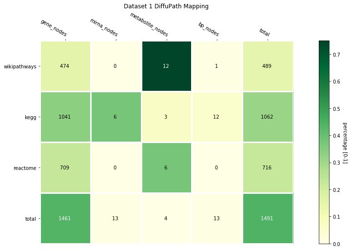
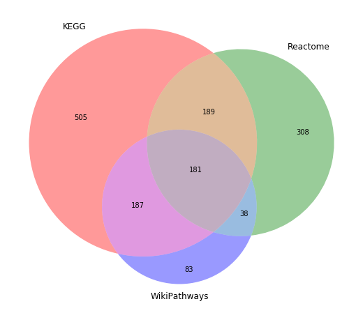
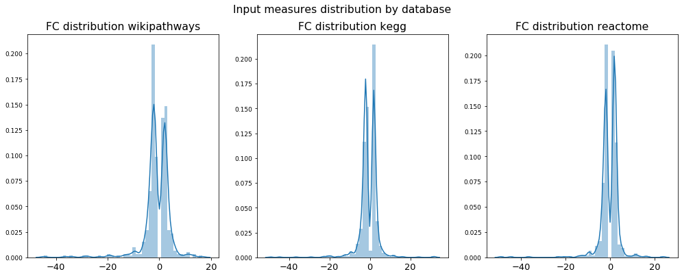
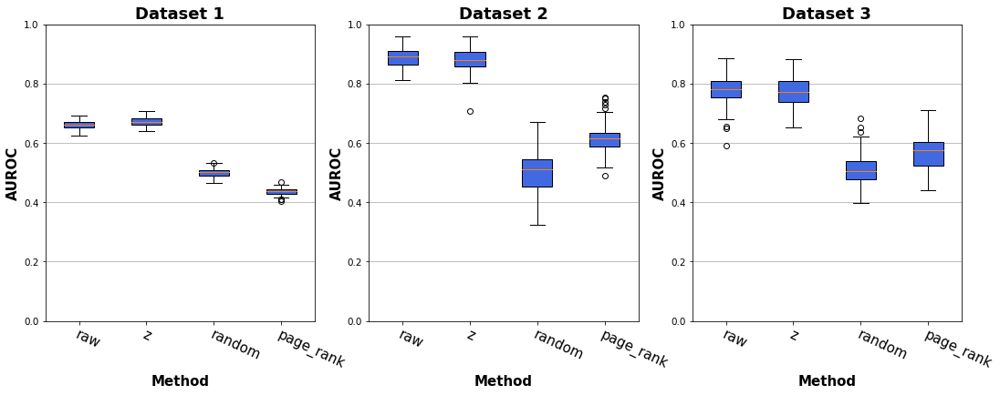
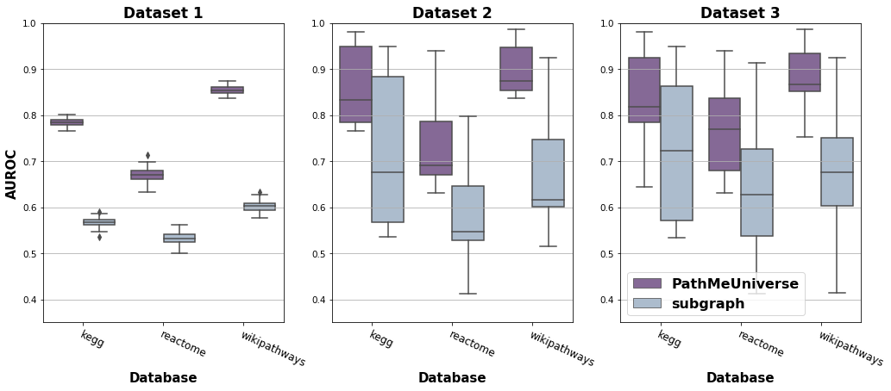
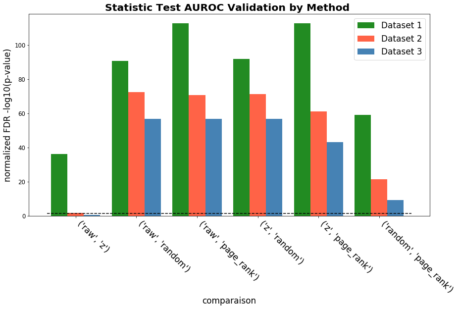

Visualization
=============
Input mapping
~~~~~~~~~~~~~

Eventhough it is not relevant for the input user usage, it is relevant for the diffusion process assessment taking into account
the input mapped entities over the background network, since the coverage of the input implies the actual entities-scores
that are being diffused. In other words, only will be further processed for diffusion, the entities which label matches
an entity in the network.

To visualize the mapping statistics heatmap, use the following function:

.. automodule:: diffupath.views.show_heatmap
   :members:

Further data views can be rendered for the input data mapping, such as VennDiagram to explore the overlap or distribution bloxplot:

.. automodule:: diffupath.views.show_venn_diagram
   :members:

.. automodule:: diffupath.views.show_distribution
   :members:

Validations
~~~~~~~~~~~

To visualize the metrics derived from validation experiments, you can plot metric Boxplots for repeated holdouts or iterated cross validation and its statistical tests and Barcharts with its threshold line:

Two dimensional BLOXPLOT:

.. automodule:: diffupath.views.show_box_plot
   :members:

Three dimensional BLOXPLOT:

.. automodule:: diffupath.views.show_sb_box_plot
   :members:

Statistical test BARCHART:

.. automodule:: diffupath.views.fdr_barchart_three_plot
   :members:

